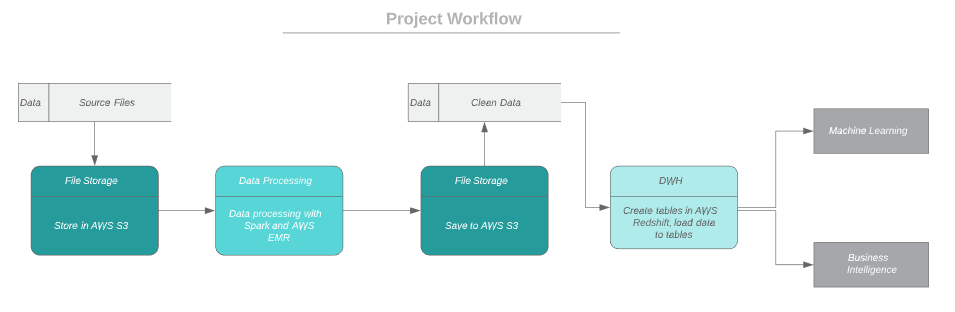
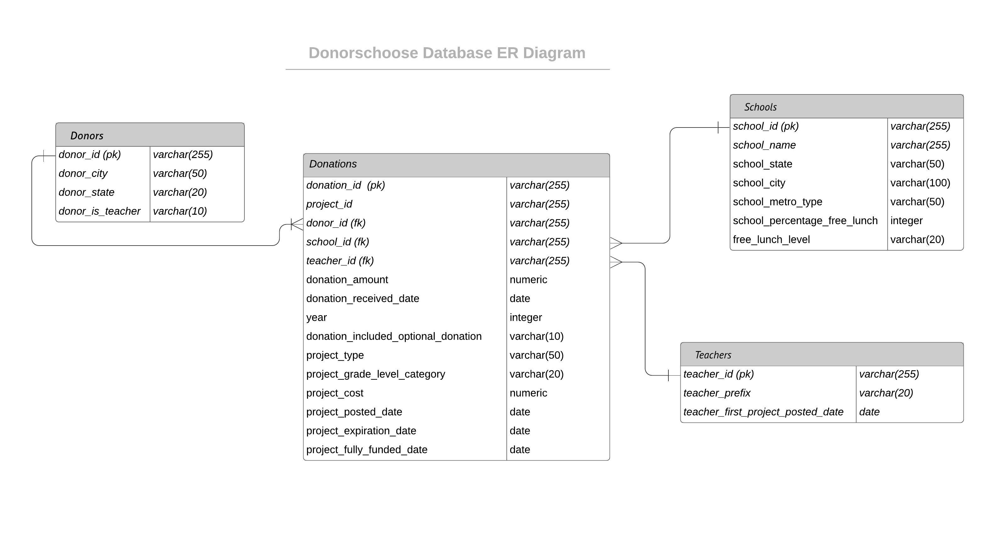

# DonorsChoose Donations Data Engineering

## Background

DonorsChoose.org is a leading platform for supporting public education. Teachers post projects requesting what their students need and donors donte money to support the projects.

DonorsChoose.org has raised around $700 million for America's classrooms, but teachers still spend more than a billion dollors of their own money on classroom materials.

So DonorsChoose.org in partnership with Google.org published a Data Science for Good challenge in Kaggle, inviting the community to help them pair up donors to the classroom requests that will most motivate them to make an additional gift. 

## Introduction

The scope of this data engineering project is to provide the data infracture to analyze donation and donation-related data. 

With clean and structured data in data warehouse, it's easier for DonorsChoose.org to explore their use cases, for example:
   
   -    How much dontion amount is made by teachers?
   -    How much fund DonorsChoose.org earns?
   -    How many donations are made at the day of project posted or the day of project fully funded?
   -	What grade receives the highest amount of donations?
   -    How many donations are made by the donors who live in the same city of the posted project?
   -	More
   
The data warehouse can also help DonorsChoose to apply machine learning models and BI tools.

The workflow of this project is extracting the data from the files stored in AWS S3, transforming the data by using Spark in AWS EMR and saving data in CSV format to AWS S3 again, then loading the proccessed data to AWS Redshift.

The advantage of making the entire process on cloud is to reduce the processing time. Spark shines on big volume data processing by its auto-scaling ability.

## Datasets:

The original files are avaiable at [Kaggle](https://www.kaggle.com/yelp-dataset/yelp-dataset) website - https://www.kaggle.com/donorschoose/io

For practice purpose, Schools file is converted from CSV format to JSON format, and Projects file is pre-processed to only include the projects active in 2018 by using filter 'project expired date >= 2018-01-01', and Resource file is ignored.

Five datasets are used in this project:

- Donations Data: used for building donations fact table

- Projects Data: used for buidling donations fact table

- Teachers Data: used for building teachers dimension table

- Donors Data: used for building donors dimension table

- Schools Data: used for building schools dimension table

### Dimension Tables:

    - dim_donors
    - dim_teachers
    - dim_schools

### Fact Table:

    - fact_donations

### Database Model (STAR Schema)

* More details about the data are available in the data dictionary (data_dictionary.md).

## Tooling and Setup

- `Amazon S3` for File Storage

- `Amazon EMR` and `PySpark` for Data Processing

- `Amazon Redshift` for Data Storage

### AWS EMR (Managed Hadoop Framework)

- create a cluster
- software configuration: go to advance options, make sure Hadoop 2.8.5, Hive 2.3.5, Spark 2.4.3 are selected to be installed 
- hardware configuration: I used 3 m5.xlarge instances
- create a notebook: choose an existing cluster, the one just created and is active

### AWS Redshift (Fast, simple, cost-effective data warehouse)

- launch a cluster: I used dc2.large * 2 nodes
- fill [CLUSTER] and [IAM_ROLE] information in dwh.cfg file
- Redshift Query editor can be used to write and run queries after data warehouse is built

## Files in the Repository

- donorschoose.ipynb: data processing for raw data, using Spark in EMR; data quality check steps are included (checking temp view count is not equal to 0) 

- create_load_tables.py: create the fact and dimension tables for the star schema in Redshift

- sql_queries.py: contains all sql queries, which are imported into create_load_tables.py

- dwh.cfg: stores cluster, IAM role, S3 file path information, which are imported to two python files above

- data_dictionary.md: explains data in details

- README.md: provides the discussion about this project

- 'img' folder: stores the images

- 'result' folder: stores the screenshots of queries results from AWS Redshift Query Editor; data quality checks are included (checkng table count matches temp views above)

## Further Discussion
The following scenarios were requested to be addressed:

1. **The data was increased by 100x.** Services on cloud have great ability to deal with big volume of data. The 'EMR + Spark' approach used in this project can still process the data quickly and smoothly even when the data was increased by 100x 

2. **The pipelines would be run on a daily basis by 7 am every day.** Apache Airflow can accomplish this task easily. Set "schedule_interval='0 7 * * *'" in DAG.

3. **The database needed to be accessed by 100+ people.** A large group of people can work on the database on cloud simultaneously. AWS Redshift service is a good choice. And for security purpose, administrator can create account groups with different level of access to the database.